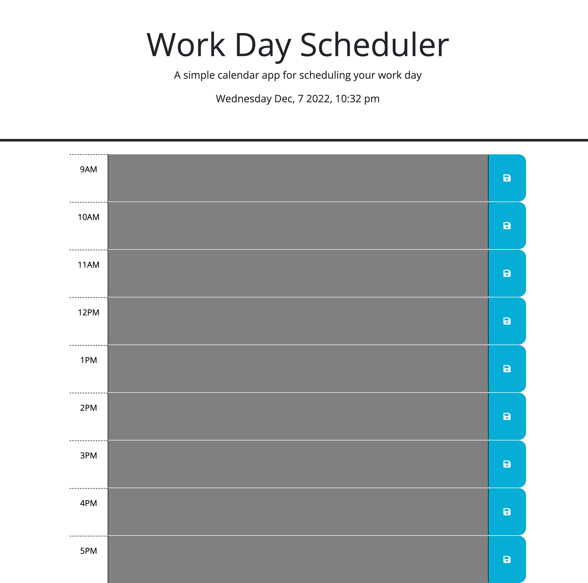

# Daily Schedule Planner

[Link to my project](https://github.com/uiido/day-schedule-planner)

[Link to my project page](https://uiido.github.io/day-schedule-planner/)

## Table of Contents
- [Description](#description)
- [Visuals](#visuals)

## Description
This is a daily schedule planner - offering time slots every hour between 9 am and 5pm. Users will fill out the text area in each time slot and hit the save button to send the information to local storage. The current hour's timeslot will be red in color, while future timeslots will appear green and past will appear gray. At midnight, the planner will automatically clear local storage to allow for the planner to be used the following day.

## Visuals

